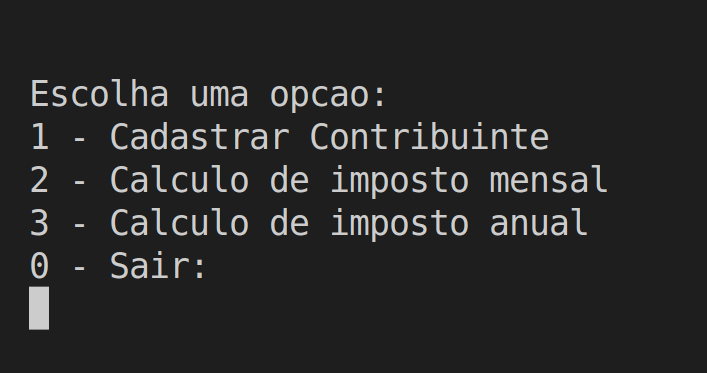
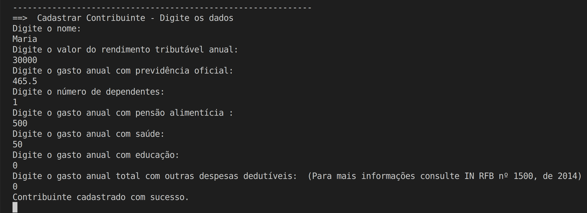
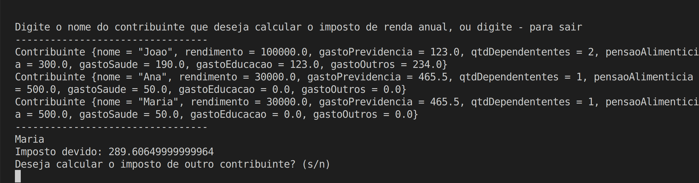

# Calculadora IR

**Disciplina**: FGA0210 - PARADIGMAS DE PROGRAMAÇÃO - T01 <br>
**Nro do Grupo**: 05<br>
**Paradigma**: Funcional<br>

## Alunos

| Matrícula | Aluno                                                                    |
| --------- | ------------------------------------------------------------------------ |
| 150125682 | [Flávio Vieira Leão](https://github.com/flaviovl)                        |
| 170011020 | [Gabrielle Ribeiro Gomes](https://github.com/Gabrielle-Ribeiro)          |
| 170107426 | [Kayro César Silva Machado](https://github.com/kayrocesar)               |
| 170016838 | [Lucas Lopes Xavier](https://github.com/lucaslop)                        |
| 180105604 | [Luis Gustavo Ferreira Marques](https://github.com/luisgfmarques)        |
| 180106805 | [Mateus Cunha Maia](https://github.com/mateusmaiamaia)                   |
| 170122549 | [Paulo Goncalves Lima](https://github.com/PauloGoncalvesLima)            |
| 190117401 | [Thalisson Alves Gonçalves de Jesus](https://github.com/Thalisson-Alves) |
| 180149598 | [Victor Hugo Siqueira Costa](https://github.com/8ifq3)                   |

## Sobre

O projeto consiste em uma calculadora de imposto de renda que tem a capacidade de ler os rendimentos tributáveis de uma pessoa física pessoa física e imprime o valor do imposto, que será calculado, no terminal. A calculadora tem duas funções, uma para o calculo do imposto mensal e outra para o anual.

## Instalação

Tenha o [Docker](https://docs.docker.com/engine/install/) instalado na sua máquina.


**Linguagens**: Haskell<br>
**Tecnologias**: Haskell<br>
**Dependências**: Docker e Make<br>

## Execução

Para poder executar o projeto, baixe o repositório, entre na pasta do repositório e execute o comando:

```bash
make run
```

Caso queira executar direto pelo Docker, execute os seguintes comandos:

```bash
docker build -t tb1_g5_calculadora_irpf .
docker run -it --name 2023_1_tb1_g5_calculadora_irpf tb1_g5_calculadora_irpf
```

Que irá iniciar o container com o nosso projeto pronto para ser testado.

## Uso 

Ao iniciar o programa utilizando os tutorial de execução, o programa será aberto e será mostrado no terminal para o usuário a seguinte tela:





Na opção 1 o usuário irá informar no programa alguns dados necessários para calcular o imposto, como na imagem abaixo:



Tanto a opção 2 como a opção 3 servem para calcular o imposto, mensal e anual, respectivamente, porem para realizar esses cálculos, será necessário que o usuário realize o cadastro primeiro.




E por fim, a opção 0 serve para o usuário encerrar o programa.

## Vídeo

Acesse o vídeo por [aqui](mudar_isso_depois).

## Participações

| Nome do Membro                                                           | Contribuição                                                                                                                                        | Significância da Contribuição para o Projeto (Excelente/Boa/Regular/Ruim/Nula) |
| ------------------------------------------------------------------------ | --------------------------------------------------------------------------------------------------------------------------------------------------- | ------------------------------------------------------------------------------ |
| [Flávio Vieira Leão](https://github.com/flaviovl)                        |Atuei principalmente no gerenciamento de dados com implementação de funções em Haskell para lidar com a leitura e escrita de dados usando a Biblioteca Selda e organizar o código em módulos separados. | Excelente                                                                               |
| [Gabrielle Ribeiro Gomes](https://github.com/Gabrielle-Ribeiro)          |Colaborei com a implementação do módulo responsável pelos cálculos do imposto anual e mensal. Além disso, ajudei na parte do docker. | Boa   |
| [Kayro César Silva Machado](https://github.com/kayrocesar)               |Fiquei responsável pela parte dos menus, submenus e da integração dos menus com as funções de cálculo de imposto e dados, também revisei pull requests.                                                                                                                                                     |           Excelente                                                                     |
| [Lucas Lopes Xavier](https://github.com/lucaslop)                        | Neste trabalho fiquei responsável pela criação do modúlo de cálculos. Colaborei com a parte dos cálculos e das funções de impostos e deduções                                                                                                                                                     | Boa                                                                               |
| [Luis Gustavo Ferreira Marques](https://github.com/luisgfmarques)        | menu,integração,calculo_imposto,revisões                                                                                                            | Boa                                                                            |
| [Mateus Cunha Maia](https://github.com/mateusmaiamaia)                   | Ajudei na implementação do módulo de menu e auxiliei na integração. Além disso contribui com o readme do projeto nos pontos de uso, sobre e outros. | Boa                                                                            |
| [Paulo Goncalves Lima](https://github.com/PauloGoncalvesLima)            |Implementação do módulo de cálculo do imposto de renda, dockerização e auxilio na integração do módulo de cálculo com o do menu                                                                                                                                                 | Excelente                                                                                |
| [Thalisson Alves Gonçalves de Jesus](https://github.com/Thalisson-Alves) | Fiquei responsável pelo módulo de persistência de dados em arquivos, além disso ajudei na integração dos diferentes módulos do projeto e revisões de pull requests. | Excelente |
| [Victor Hugo Siqueira Costa](https://github.com/8ifq3)                   | Concepção e Criação do Banco de Dados com a biblioteca Selda, Estruturação do projeto Haskel e empacotamento com o Cabal, Pareamento com vários membros para solução de dúvidas e problemas, Solução de conflitos com versionamento e dependências, Ajuda em outras partes/módulos. | Excelente |

## Outros 
Criar esta calculadora usando a linguagem Haskell e o paradigma funcional foi uma ótima experiência para a equipe. Usando uma abordagem funcional, você pode criar soluções mais elegantes e compreensíveis, reduzindo a probabilidade de erros e comportamento indesejado do programa. Além disso, a linguagem Haskell, com seus tipos fortes e ênfase em funções, oferece uma experiência de programação mais robusta e segura. Apesar de haver alguns pontos a serem melhorados, tanto no projeto como no grupo, o resultado final foi bastante satisfatório para os membros no geral. Os principais pontos do projeto estão listados abaixo:

* Lições aprendidas: 
    * A linguagem Haskell básica foi a primeira lição aprendida pelo grupo, visto que, a maior parte do grupo nunca tinham trabalhado com ela.
    * Utilização de funções recursivas na criação do projeto. 
    * O projeto nos deu uma boa noção de como utilizar um paradigma funcional para solucionar problemas dentro da área de programação.
* Percepções:
    * A percepção mais importante, que o grupo teve durante a realização do trabalho, foi a de resolver os problemas utilizando a modularização, proporcionado pelo paradigma funcional. 

* Contribuições e Fragilidades: 
    * A organizou bem como seria realizado o trabalho, cada trio ficou responsável por um módulo (menu, dados e cálculo) e no final todos se juntaram para fazer a integração.
    * Um dos pontos que a equipe poderia melhorar seria na organização do time, pois houve uma certa dificuldade para o grupo se reunir, com todos presentes.
* Trabalhos futuros: 
    * Uma boa adição para esse projeto seria utilizar os dados entregues pelo usuário para calcular o valor da restituição do imposto.
    * Uma possibilidade de melhoria futura estaria na adição de calculo de imposto na forma simplificada, uma vez que a calculadora do grupo utilizou apenas o calculo utilizando as deduções completas.
    * Melhoria no visual.

## Fontes


> Ministério da Economia (Brasil). Receita Federal. Simulador IRPF [online]. Disponível em: https://www27.receita.fazenda.gov.br/simulador-irpf/. Acesso em: 05 maio 2023.

> Onze. Como calcular Imposto de Renda? [online]. Disponível em: https://www.onze.com.br/blog/calcular-imposto-de-renda/#:~:text=Soma%20dos%20rendimentos%20tribut%C3%A1veis%20%E2%80%93%2020,a%20ser%20quitado%20ou%20restitu%C3%ADdo.. Acesso em: 05 maio 2023.

> The Haskell.org Committee. Haskell Documentation [online]. Disponível em: https://www.haskell.org/documentation/. Acesso em: 05 maio 2023.

> Machado, Andrey. Programação Haskell [online]. Curitiba: Universidade Federal do Paraná, Departamento de Informática, 2006. Disponível em: https://www.inf.ufpr.br/andrey/ci062/ProgramacaoHaskell.pdf. Acesso em: 05 maio 2023.
